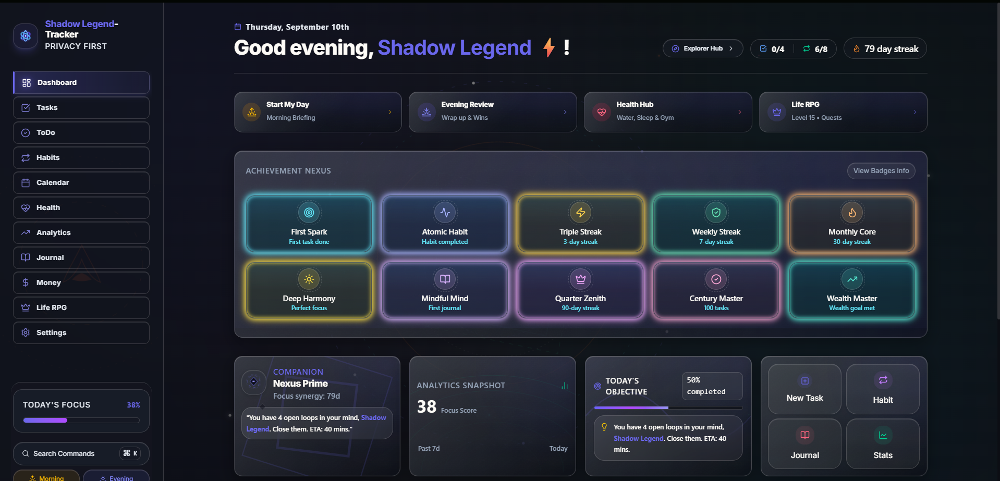
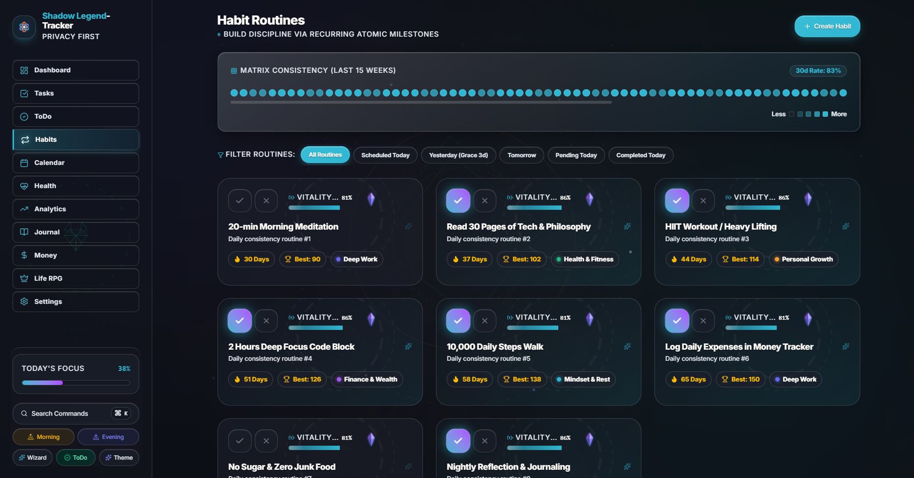
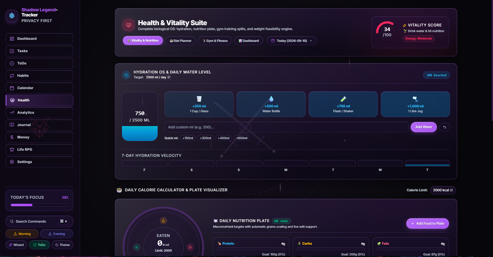
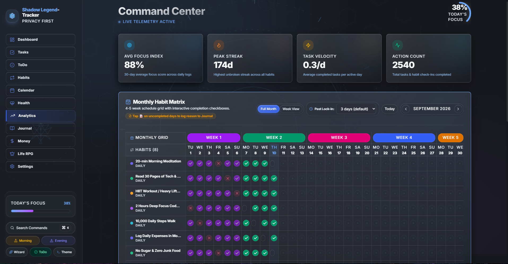

# Shadow-Tracker-Life-OS

<p align="center">
  
</p>

<h3 align="center">Local-First • Privacy-First • Gamified Personal Productivity &amp; Habit Tracker</h3>

<p align="center">
  <a href="https://hub.docker.com/r/vibishnathang/shadow-tracker"></a>
  <a href="https://hub.docker.com/r/vibishnathang/shadow-tracker"></a>
  <a href="https://github.com/VibishnathanG/Shadow-Tracker/releases"></a>
  
  
  
  
  <a href="./LICENSE"></a>
</p>

---

## Project-Overview

**Shadow Tracker** is a local-first personal dashboard built to track daily habits, manage tasks, log nutrition and workouts, plan finances, and stay consistent with an RPG-style leveling system. 

All your data stays completely on your device — stored locally in IndexedDB and LocalStorage. There are no mandatory accounts, no cloud dependencies, and zero analytics tracking.

---

## Visual-Showcase

A quick tour of the dark, glassy desktop UI.

### 1-Life-OS-Command-Dashboard

The central dashboard brings together morning briefings, evening reviews, daily health logs, focus scores, and character leveling in a unified workspace.



---

### 2-Atomic-Habits-and-Consistency-Matrix

Build lasting daily routines with categorized habit cards, streaks, vitality indicators, and a 15-week consistency heatmap.



---

### 3-Health-and-Vitality-Suite

Track daily hydration with quick-add logging and a 7-day history chart, set calorie targets, visualize meals with the interactive nutrition plate (Protein, Carbs, Fats), and log workout routines.



---

### 4-Command-Center-and-Monthly-Habit-Telemetry

A 5-week monthly habit grid with daily check-offs, past-date lock-in protection, streak counters, and focus metrics.



[↑ Back to top](#Shadow-Tracker-Life-OS)

---

## Table-of-Contents

- [Project-Overview](#Project-Overview)
- [Visual-Showcase](#Visual-Showcase)
  - [1-Life-OS-Command-Dashboard](#1-Life-OS-Command-Dashboard)
  - [2-Atomic-Habits-and-Consistency-Matrix](#2-Atomic-Habits-and-Consistency-Matrix)
  - [3-Health-and-Vitality-Suite](#3-Health-and-Vitality-Suite)
  - [4-Command-Center-and-Monthly-Habit-Telemetry](#4-Command-Center-and-Monthly-Habit-Telemetry)
- [Docker-Container-Deployment](#Docker-Container-Deployment)
  - [Pull-from-Docker-Hub](#Pull-from-Docker-Hub)
  - [Run-with-Docker-CLI](#Run-with-Docker-CLI)
  - [Run-with-Docker-Compose](#Run-with-Docker-Compose)
  - [Offline-Docker-Tarball-Loading](#Offline-Docker-Tarball-Loading)
- [Official-Release-Artifacts](#Official-Release-Artifacts)
  - [Release-Matrix-and-Checksums](#Release-Matrix-and-Checksums)
  - [Integrity-Verification](#Integrity-Verification)
  - [Windows-Installation-and-Certificate-Trust](#Windows-Installation-and-Certificate-Trust)
  - [Android-APK-Installation](#Android-APK-Installation)
- [System-Architecture](#System-Architecture)
- [Application-Lifecycle](#Application-Lifecycle)
  - [1-Boot-and-Hydration](#1-Boot-and-Hydration)
  - [2-Resource-Optimization-and-Idle](#2-Resource-Optimization-and-Idle)
  - [3-Background-Workers-and-Notifications](#3-Background-Workers-and-Notifications)
- [Life-RPG-and-XP-Internals](#Life-RPG-and-XP-Internals)
  - [XP-Calculation-Formulas](#XP-Calculation-Formulas)
  - [Action-XP-Rewards-Table](#Action-XP-Rewards-Table)
  - [Character-Rank-Progression](#Character-Rank-Progression)
  - [Quest-System-and-Multipliers](#Quest-System-and-Multipliers)
  - [Achievement-Badges-Catalog](#Achievement-Badges-Catalog)
- [Feature-Suite-Deep-Dive](#Feature-Suite-Deep-Dive)
  - [Dashboard-and-Life-OS](#Dashboard-and-Life-OS)
  - [Tasks-Workspace-Grid-and-List](#Tasks-Workspace-Grid-and-List)
  - [Standalone-ToDo-Engine](#Standalone-ToDo-Engine)
  - [Atomic-Habits-Engine](#Atomic-Habits-Engine)
  - [Calendar-and-Time-Blocking](#Calendar-and-Time-Blocking)
  - [Health-and-Vitality-Suite](#Health-and-Vitality-Suite)
  - [Money-and-Financial-Tracker](#Money-and-Financial-Tracker)
  - [Shadow-Wizard-Companion](#Shadow-Wizard-Companion)
  - [Reflections-Journal](#Reflections-Journal)
  - [Analytics-Room](#Analytics-Room)
- [Theme-Ambient-Engine](#Theme-Ambient-Engine)
  - [Eco-Mode-and-Low-GPU-Mode](#Eco-Mode-and-Low-GPU-Mode)
- [Backup-Restore-and-Cloud-Sync](#Backup-Restore-and-Cloud-Sync)
  - [1-Local-JSON-Backup-and-Restore](#1-Local-JSON-Backup-and-Restore)
  - [2-Microsoft-OneDrive-Auto-Sync](#2-Microsoft-OneDrive-Auto-Sync)
  - [3-GitHub-Gist-Daily-Sync](#3-GitHub-Gist-Daily-Sync)
- [Running-and-Deployment](#Running-and-Deployment)
  - [Prerequisites](#Prerequisites)
  - [Development-Mode](#Development-Mode)
  - [Production-Static-Export-Build](#Production-Static-Export-Build)
  - [Desktop-Executable-Build-Tauri-2](#Desktop-Executable-Build-Tauri-2)
  - [Mobile-Android-Build-Capacitor-8](#Mobile-Android-Build-Capacitor-8)
- [Verification-Checklist](#Verification-Checklist)
- [License](#License)

[↑ Back to top](#Shadow-Tracker-Life-OS)

---

## Docker-Container-Deployment

Shadow Tracker is containerized with a lightweight multi-stage Nginx Alpine image published on Docker Hub under [`vibishnathang/shadow-tracker`](https://hub.docker.com/r/vibishnathang/shadow-tracker).

### Pull-from-Docker-Hub

```bash
# Pull latest beta release
docker pull vibishnathang/shadow-tracker:beta

# Or pull latest stable release
docker pull vibishnathang/shadow-tracker:latest
```

### Run-with-Docker-CLI

```bash
# Run detached container exposing port 8081
docker run -d \
  --name shadow-tracker \
  -p 8081:80 \
  --restart unless-stopped \
  vibishnathang/shadow-tracker:latest

# Verify health endpoint
curl -sI http://localhost:8081/health
```
Navigate to `http://localhost:8081` in your browser.

### Run-with-Docker-Compose

Use the included [docker-compose.yml](file:///Main_Workspace/Programming/Python/workspace/shadow-tracker/docker-compose.yml) for single-command management:

```bash
# Start production container
docker compose up -d prod

# View logs
docker compose logs -f prod

# Stop container
docker compose down
```

### Offline-Docker-Tarball-Loading

For air-gapped or offline workstations, use the pre-packaged archive from `release/`:

```bash
# Load Docker image from release bundle
docker load < release/shadow-tracker-container.tar.gz

# Run loaded container
docker run -d --name shadow-tracker -p 8081:80 shadow-tracker:latest
```

[↑ Back to contents](#Table-of-Contents)

---

## Official-Release-Artifacts

Every release binary in the `release/` directory is standardized, compiled, cryptographically hashed, and verified.

### Release-Matrix-and-Checksums

| Artifact Name | Target Platform | Package Type | Size | SHA256 Checksum | Reference Note |
|---|---|---|---|---|---|
| `Shadow-Tracker-Setup.exe` | Windows 10/11 (x64) | NSIS Executable Installer | 14.0 MB | `78d7ac982d358623a55ec2b694cd0b86646660c831999dd3082a41adc5fe0ac0` | |
| `Shadow-Tracker-Portable.exe` | Windows 10/11 (x64) | Single Portable Executable | 30.6 MB | `4a3611143bca9884994489c7352acb0a7f83d5d30f8a11cf7f2a0acc4eca1f60` | |
| `Shadow-Tracker-Release.apk` | Android 8.0+ (ARM64/x86) | Signed Mobile APK | 13.5 MB | `7bf7cff96e0c9ce3ca5ee9dff570a928b8dc99f873864ecb92c011932f3581ef` | |
| `shadow-tracker-container.tar.gz` | Linux (x86_64 Docker) | Docker Image Tarball | 36.9 MB | `5e6742dfc8b0157ae5f5b3a5730ffeae9e85132511c787573f1f96d1185fdc43` | |
| `shadow-tracker-web-export.tar.gz` | Any Static Web Host | Static HTML5/JS/CSS Bundle | 9.5 MB | `0eb59e91a5ea1e16265f8a852e60b1de3d44fdc4cce7fbfe6eb4f6df1261f202` | |
| `Shadow-Tracker-Windows-Certificate.crt` | Windows OS | Trusted Root Signing Cert | 1.3 KB | `aabc149abd60a904878ebfc939611500ed636d22b61157cd891c3c2937ba4c98` | |

### Integrity-Verification

Verify all release package checksums in a single step using the provided manifest:

```bash
cd release
sha256sum -c SHA256SUMS.txt
```

Expected output:
```text
Shadow-Tracker-Release.apk: OK
shadow-tracker-container.tar.gz: OK
shadow-tracker-web-export.tar.gz: OK
Shadow-Tracker-Portable.exe: OK
Shadow-Tracker-Setup.exe: OK
Shadow-Tracker-Windows-Certificate.crt: OK
```

### Windows-Installation-and-Certificate-Trust

Because Windows SmartScreen checks for recognized publisher certificates, install the code signing certificate to run without warnings:

1. Double-click `release/Shadow-Tracker-Windows-Certificate.crt`.
2. Click **Install Certificate...** → Select **Local Machine**.
3. Place in **Trusted Root Certification Authorities**.
4. Run `Shadow-Tracker-Setup.exe` (or `Shadow-Tracker-Portable.exe`).

### Android-APK-Installation

1. Transfer `release/Shadow-Tracker-Release.apk` to your Android device via USB, Drive, or local HTTP server.
2. Enable *Install Unknown Apps* for your file manager.
3. Tap the APK to install.
4. Grant notification and exact alarm permissions when prompted to enable the background habit reminder chimes.

[↑ Back to contents](#Table-of-Contents)

---

## System-Architecture

Shadow Tracker is architected upon an offline-first foundation where local clients (browser, desktop Tauri shell, or mobile Capacitor container) operate as the sole source of truth.

```
┌────────────────────────────────────────────────────────────────────────┐
│                        SHADOW TRACKER CLIENT                           │
├──────────────────────────────┬─────────────────────────────────────────┤
│    Presentation Layer        │ Next.js 16 (Turbopack) + React 19       │
│    Styling & Shaders         │ TailwindCSS v4 + Glassy Tokens          │
│    Motion & Kinetics         │ Framer Motion + Canvas Confetti         │
│    State & Reactive Stores   │ Zustand 5 + Reactive Events             │
├──────────────────────────────┼─────────────────────────────────────────┤
│    Local Storage Engines     │ IndexedDB (`shadow_tracker_db`)         │
│                              │ Web Storage (`localStorage` v4)         │
├──────────────────────────────┼─────────────────────────────────────────┤
│    Hardware & Native APIs    │ Web Speech Synthesis (`SpeechSynthesis`)│
│                              │ File System Access API                  │
│                              │ Capacitor 8 (Android Background Alarms) │
│                              │ Tauri 2 (Rust Desktop Shell)            │
├──────────────────────────────┼─────────────────────────────────────────┤
│    Sync Connectors           │ Microsoft OneDrive Auto-Sync            │
│                              │ GitHub Gist Daily Sync                  │
│                              │ Portable JSON Encrypted Backups         │
└──────────────────────────────┴─────────────────────────────────────────┘
```

[↑ Back to contents](#Table-of-Contents)

---

## Application-Lifecycle

Shadow Tracker is built for fast startup, low battery impact, and reliable offline data storage.

### 1-Boot-and-Hydration
1. **HTML Bootstrap**: Theme and layout tokens are read synchronously from `localStorage` to avoid flash-of-unstyled-content.
2. **IndexedDB Initialization**: The local database service opens `shadow_tracker_db` with stores for:
   - `tasks`
   - `habits`
   - `dailyLogs`
   - `notes`
   - `reminders`
   - `categories`
3. **Zustand Store Hydration**: State loads asynchronously from local storage without freezing the UI.
4. **Platform Event Listeners**:
   - Page Visibility API listens for tab and window visibility changes.
   - Desktop Tauri IPC listens for Eco Mode and system tray minimize events.

### 2-Resource-Optimization-and-Idle
When Shadow Tracker is minimized or sent to the system tray:
- Framer Motion animation loops unmount cleanly.
- Ambient canvas backgrounds pause rendering to save battery and GPU cycles.
- Background tabs idle and suspend CSS animations using the `.is-hidden` root state.

### 3-Background-Workers-and-Notifications
- **Capacitor Alarms (Android)**: Exact scheduled triggers invoke `@capacitor/local-notifications` with quick action buttons.
- **Web Worker Audio Timer**: Subtle arpeggiated tones play via Web Audio API when timers finish, without downloading external audio files.

[↑ Back to contents](#Table-of-Contents)

---

## Life-RPG-and-XP-Internals

Shadow Tracker turns daily discipline into an RPG progression system. Every completed task, habit check-off, workout, and logged meal awards Experience Points (XP) to level up your character.

### XP-Calculation-Formulas

$$\text{Next Level XP} = 100 \times \text{Level}^{1.5}$$

Cumulative XP required to reach Level $L$:

$$\text{Total XP}(L) = \sum_{k=1}^{L-1} \left\lfloor 100 \times k^{1.5} \right\rfloor$$

### Action-XP-Rewards-Table

| Action | XP Awarded | Multiplier Trigger | Reference Note |
|---|---|---|---|
| Complete Standard Task | +25 XP | Priority: High (1.5x), Urgent (2.0x) | |
| Complete Habit Routine | +15 XP | Streak Multiplier: +5% per 5 consecutive days | |
| Hit Daily Nutrition Goal | +30 XP | Perfect macro alignment within 5% | |
| Log Gym Strength Session | +40 XP | Full workout completion | |
| Water Target Achieved (100%) | +20 XP | Daily 8-10 glasses | |
| Morning / Evening Day Review | +20 XP | Per review completed | |
| Interact with Shadow Wizard | +10 XP | Click 3D Wizard Mascot | |
| Add Custom Wisdom Quote | +15 XP | New custom wisdom inscribed | |
| Epic Quest Milestone | +500 XP | 30-day streak achievement | |

[↑ Back to contents](#Table-of-Contents)

---

### Character-Rank-Progression

Your character title evolves automatically across 20 tiers as you cross XP thresholds:

```
[Level 1-4]   ──► Novice Wanderer
[Level 5-9]   ──► Shadow Initiate
[Level 10-14] ──► Arcane Apprentice
[Level 15-19] ──► Disciplined Adept
[Level 20-29] ──► Void Ranger
[Level 30-39] ──► Master Arcanist
[Level 40-49] ──► Shadow Sovereign
[Level 50+]   ──► Immortal Void Emperor
```

[↑ Back to contents](#Table-of-Contents)

---

### Quest-System-and-Multipliers

Quests are dynamically refreshed and tracked in `LifeRpgFeature.tsx`:

1. **Daily Quests (Refreshed every 24 hours)**:
   - *Deep Work Sprint*: Complete 2+ hours of focused high-priority tasks.
   - *Iron Discipline*: Check off all scheduled physical training routines.
   - *Macro Synchronization*: Log all daily meals and reach within 10% of protein targets.
2. **Epic Quests (Long-Term Mastery)**:
   - *Architect of Dynasty*: Sustain a 30-day streak across core habits.
   - *Financial Sovereign*: Save 30%+ of monthly revenue for 3 consecutive months.
   - *Grand Scholar*: Inscribe and reflect on 25+ wisdom scrolls.

[↑ Back to contents](#Table-of-Contents)

---

### Achievement-Badges-Catalog

Badges are awarded for milestones and persisted in `shadow_unlocked_badges`.

| Badge ID | Badge Title | Criteria | Glow Accent | Reference Note |
|---|---|---|---|---|
| `badge-first-task` | First Blood | Complete your first task | Electric Blue | |
| `badge-first-habit` | Seed of Routine | Establish and log your first habit | Emerald Mint | |
| `badge-streak-3` | Triad Spark | Reach a 3-day consistency streak | Solar Gold | |
| `badge-streak-7` | Week Warrior | Complete 7 consecutive days of execution | Flame Orange | |
| `badge-streak-30` | Unbreakable Will | Maintain a 30-day uninterrupted streak | Royal Amethyst | |
| `badge-streak-90` | Grandmaster | Maintain 90 days of discipline | Radiant Rose | |
| `badge-perfect-day` | Flawless Execution | 100% tasks and habits checked off in a day | Pure Diamond White | |
| `badge-first-note` | Chronicle Inscribed | Author your first reflection note | Cyan Laser | |
| `badge-wealth-master` | Golden Treasury | Achieve a full month financial budget balance | Warm Amber | |
| `badge-vitality-titan` | Iron Temple | Complete 20 structured strength workouts | Crimson Fire | |

[↑ Back to contents](#Table-of-Contents)

---

## Feature-Suite-Deep-Dive

### Dashboard-and-Life-OS
- **Life OS Bar**: 4-column launcher cards for *Start My Day* (Morning Briefing), *Evening Review* (Wins & Reflections), *Health Hub* (Water, Sleep, Nutrition), and *Life RPG* (Character level, quest log).
- **Focus Score Metric**: Real-time calculated score (0-100%) incorporating task completion density, habit consistency, and daily reflections.
- **3D Wizard Companion Button**: Quick launcher in the header providing instant focus motivation and daily reflections.

### Tasks-Workspace-Grid-and-List
- **Dual View Modes**:
  - **Grid View**: Multi-column responsive layout displaying rich details, tags, subtasks, and category chips.
  - **List View**: Ultra-compact high-density rows for rapid sorting, editing, and triage.
- **Priority Matrix**: High, Medium, Low priority tags with custom sorting options.
- **Recurring Engine**: Automated recurrence patterns (daily, weekly, custom days).

### Standalone-ToDo-Engine
- Dedicated fast-capture checklist with independent category presets.
- Nested hierarchical subtasks with individual progress bars.
- Schedule selectors with date/time pickers and sound notifications.

### Atomic-Habits-Engine
- Continuous heatmaps displaying 365-day historical consistency.
- Automatic calculation of current streak and all-time longest streak.
- Configurable grace periods (1 to 7 days) to protect streaks during planned rest days.

### Calendar-and-Time-Blocking
- Monthly calendar grid intersected with habit check-offs, task due dates, and journal notes.
- Dedicated **Time-Blocking View** for hourly scheduling and deep focus blocks.

### Health-and-Vitality-Suite
- **Vitality & Nutrition**:
  - Visual plate visualizer tracking Macronutrients (Protein, Carbs, Fats) and total Calories.
  - Water intake tracker with interactive glass counters and velocity trendline.
  - Sleep duration and quality gauges.
- **Diet Planner Sub-Tab**:
  - 7-day weekly meal planner with 1-click **Copy to Today Plate** integration.
  - Custom diet plan creator with automatic BMR and TDEE calorie targets.
  - Extensive built-in Indian and international whole-food nutrition database.
- **Gym & Fitness Tab**:
  - Push/Pull/Legs and Upper/Lower training split logs.
  - Exercise sets, target reps, rest timers, and weight volume tracking.
- **Biometric Feasibility Calculator**:
  - Realistic time-to-goal projections based on calorie deficits and weekly metabolic adaptation.

### Money-and-Financial-Tracker
- **Monthly Budget Map**: Dynamic tracking across 12 full months with income, savings, profits, and expense allocation.
- **Category Distribution**: Shopping, Food, Bills, Subscriptions, and Custom entries.
- **Asset Allocation**: Fixed Big Expenses (Rent, EMI, Insurance), Mutual Funds & Stock investments, and Lent/Borrowed records.

### Shadow-Wizard-Companion
- **3D Interactive Wizard Avatar**:
  - Embedded 3D hooded mascot with animated rings and responsive lighting.
  - Interactive click action: triggers speech synthesis audio recitals, bursts celebratory confetti, and awards +10 XP.
- **Wisdom & Quotes Library**:
  - Filterable by category (Power, Wisdom, Wealth, Tech, Vitality).
  - Add custom wisdom quotes with persistent local storage.

### Reflections-Journal
- Distraction-free full Markdown editor with live preview.
- Tagging system and historical archives indexed by calendar date.

### Analytics-Room
- Custom SVG focus curves mapping daily focus scores across weeks and months.
- Habit consistency scorecards and weekly radar trends.

[↑ Back to contents](#Table-of-Contents)

---

## Theme-Ambient-Engine

Shadow Tracker features 5 themes with tailored CSS variables, glassy gradient finishes, and GPU-optimized ambient canvas animations:

| Theme ID | Aesthetic Description | Background Canvas | Tile Style | Ambient Animation Concept | Reference Note |
|---|---|---|---|---|---|
| `white` / `light` | Flashy Textured White | `#edf2f7` (Cool Porcelain) | Warm Creamy Linen/Ivory (`#faf7f0`) | **Eternals Gold Runes**: Marvel *Eternals* inspired traversing gold filament circuits, rotating sacred mandalas, and floating gold stardust | |
| `purple` / `midnight` | Multi-Color Cosmic Void | `#0b0617` (Deep Celestial Void) | Glassy Dark Purple with Specular Sheen | **Multi-Color Cosmic Rings**: 4-hue concentric orbital rings (amethyst, cyan, gold, rose) with multi-hue stardust | |
| `obsidian` | Pure Pitch Black & Purple | `#07060a` (Obsidian Pitch) | Matte Glassy Black-Purple | **Astronomical Rings & Swords**: Celestial orbital rings with crossed runic swords | |
| `onedark` | Hacker Dark Blue | `#16181d` (Deep Slate) | Frosted Electric Blue Glass | **Orbital Telemetry HUD**: Rotating radar arcs, orbital rings, and pulse beacons | |
| `cyberpunk` | Neon Synthwave Grid | `#10131a` (Dark Matrix) | Cyber Neon Blue/Rose | **Isometric Grid & Cubes**: Wireframe 3D cubes floating over a perspective horizon grid | |

### Eco-Mode-and-Low-GPU-Mode
For battery conservation and ultra-low-spec hardware:
- Toggling Eco Mode switches all ambient backgrounds to **100% static SVGs** with zero Framer Motion loops and 0.0% idle CPU overhead.

[↑ Back to contents](#Table-of-Contents)

---

## Backup-Restore-and-Cloud-Sync

You own 100% of your data without relying on third-party cloud servers.

### 1-Local-JSON-Backup-and-Restore
- **Export**: Generates a unified, timestamped `shadow-tracker-full-backup-YYYY-MM-DD.json` file via the browser File System Access API.
- **Import**: Validates schema integrity, restores all IndexedDB stores and LocalStorage domains (Tasks, Habits, Daily Logs, Notes, Reminders, Categories, Money v4, Health daily logs, Biometrics, Workouts, Diets, Standalone ToDos, Quests, and Badges).
- **Annual Archives**: Archive historical data by year to keep active workspace queries lightning fast.

### 2-Microsoft-OneDrive-Auto-Sync
- Configure a dedicated sync file (e.g. `Documents/shadow-tracker-sync.json`).
- Automatically syncs bidirectionally on data change with a 3-second debouncing safety window.
- Merges remote and local datasets using timestamp reconciliation so no data is lost between devices.

### 3-GitHub-Gist-Daily-Sync
- Secure synchronization using a GitHub Personal Access Token (PAT) with encrypted storage.
- Synchronizes once daily upon launch or manually on demand.

[↑ Back to contents](#Table-of-Contents)

---

## Running-and-Deployment

### Prerequisites
- Node.js 20+ and npm
- Docker (optional, for containerized deployment)

### Development-Mode
```bash
# Install dependencies
npm install --legacy-peer-deps

# Start development server with Turbopack
npm run dev
```
Open [http://localhost:3000](http://localhost:3000) in your browser.

### Production-Static-Export-Build
```bash
# Build static export
npm run build

# Static export is generated into the `out/` directory
```

### Desktop-Executable-Build-Tauri-2
```bash
# Build Windows portable single executable and setup installer
npm run build:tauri
```
Generated binaries:
- `release/Shadow-Tracker-Setup.exe` (NSIS Installer)
- `release/Shadow-Tracker-Portable.exe` (Standalone Portable)

### Mobile-Android-Build-Capacitor-8
```bash
# Sync web export to Android Capacitor project
npx cap sync android

# Open in Android Studio or build release APK via Gradle
cd android && ./gradlew assembleRelease
```
Generated binary:
- `release/Shadow-Tracker-Release.apk`

[↑ Back to contents](#Table-of-Contents)

---

## Verification-Checklist

| System Component | Verification Status | Reference Note |
|---|---|---|
| Health Suite Diet Planner Sub-Tab | Verified (Sub-tab toggle inside Health feature) | |
| Multi-Color Cosmic Purple Theme | Verified (Deep void canvas `#0b0617`, multi-color domain accents) | |
| White Theme Creamy Ivory Tiles | Verified (Linen tiles, distinct warm borders, subtle golden accents) | |
| 3D Wizard Logo & Companion Interactivity | Verified (Sidebar logo, mobile header, Dashboard launcher, companion modal) | |
| Glassy Gradient & Non-Harsh Borders | Verified (Universal `.tile`, `.glossy-tile`, `.btn-glass`, `.badge-glass`) | |
| Backup, Restore & Demo Dataset | Verified (100% roundtrip test passed across all modern features) | |
| Bidirectional Sync Reconciliation | Verified (`mergeBackupDatasets` covers all state domains) | |
| Zero-CPU Idle Engine | Verified (Visibility API and Eco Mode static SVG fallback) | |
| Next.js Static Export & Docker Deploy | Verified (Healthy on `http://localhost:8081`) | |
| Docker Hub Published Image | Verified (`vibishnathang/shadow-tracker:latest` pushed & live) | |
| Standardized Release Artifacts | Verified (Signed APK, Setup/Portable EXE, Container tarball in `release/`) | |

[↑ Back to contents](#Table-of-Contents)

---

## License

This project is open source and licensed under the **GNU General Public License v3.0 (GPL-3.0)**. See the [LICENSE](./LICENSE) file for details.
