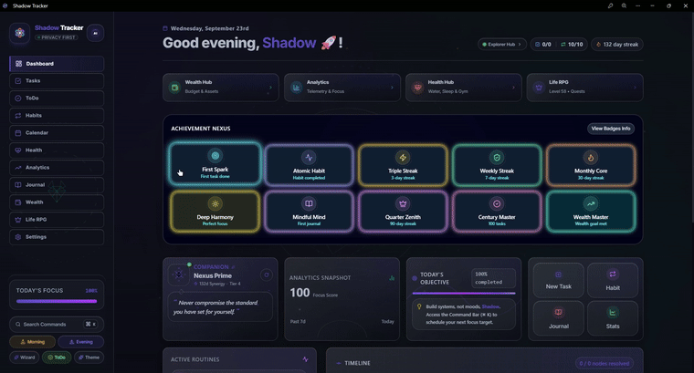

# Shadow-Tracker-Life-OS

<p align="center">
  
</p>

<h3 align="center">Offline Habits, Tasks, Health & Budget Tracker</h3>

<p align="center">
  <a href="https://hub.docker.com/r/vibishnathang/shadow-tracker"></a>
  <a href="https://hub.docker.com/r/vibishnathang/shadow-tracker"></a>
  <a href="https://github.com/VibishnathanG/Shadow-Tracker/releases"></a>
  
  
</p>

---

## App-Walkthrough-Video

Watch a 3-minute complete tour of Shadow Tracker in action:

<p align="center">
  <a href="https://github.com/VibishnathanG/Shadow-Tracker/raw/main/public/app-looks/Shadow-Tracker-Look.mp4" title="Watch full 3-minute walkthrough video">
    
  </a>
</p>

---

## Project-Overview

**Shadow Tracker** is a clean, offline personal dashboard to track your daily habits, tasks, workouts, and budget in one place.

Everything stays on your own computer. Data is saved directly in your browser without accounts, cloud sync, or external tracking.

---

## Core-Features

- **Habits**: Track daily routines with streaks and heatmaps.
- **Tasks & ToDos**: Simple priority levels, time estimates, checklists, and subtasks.
- **Health & Food**: Log water intake, calories, daily macros, and workout routines.
- **Money & Budget**: Track expenses, monthly spending envelopes, and savings goals.
- **Progress & Leveling**: Earn XP as you complete daily routines to stay consistent.
- **Focus Companions**: Lightweight animations (maglev, ninja, dragon) with an Eco Mode toggle to save battery.
- **Data Backups**: Export or restore your data anytime as a backup file.

---

## Shadow-AI-Copilot

Shadow Tracker includes an optional AI assistant that runs safe actions on your local data.

- **16 Local Tools**: Can create tasks, mark habits done, plan meals, log water, and set reminders. Strictly non-destructive (never deletes data).
- **Session Privacy**: API keys stay in temporary session memory (`sessionStorage`) and are cleared when you close the tab.
- **Custom Context**: Choose how much history the AI sees (7 days up to 1 year), or run with zero context.
- **Local Models**: Connect to OpenAI or run completely offline with local models using Ollama or LM Studio.
- **Prompt Library**: Pre-built day-to-day prompts and support for custom user tools.
- **Rich Formatting**: Outputs clean bullet points, bold text, code, and markdown tables.

---

## Performance-Benchmarks

Measured in live production tests on the official Docker image serving high-concurrency requests and large-volume client data:

| Metric | Result | Context / Notes |
|---|---|---|
| **Server Throughput** | **~7,450 req/sec** | Nginx event-driven static asset caching |
| **Average Response Latency** | **7.8 ms** (p50: 5.9 ms) | Sub-10ms response times under load |
| **Container Memory (Idle)** | **10.8 MiB RAM** | Lightweight container footprint |
| **Container Memory (Peak Load)** | **11.5 MiB RAM** | +0.7 MiB under 3,000 concurrent requests |
| **Container CPU** | **< 2%** | Negligible CPU footprint on host |
| **15k Records Parsing & Hydration** | **12.1 ms** | Fast IndexedDB & JSON deserialization |
| **Full 1-Year AI Snapshot** | **~9,000 tokens** | Fits easily inside 16k/32k/64k token ceilings |

---

## Quick-Start-and-Docker

Run Shadow Tracker in seconds using Docker:

```bash
docker run -d \
  --name shadow-tracker \
  --restart unless-stopped \
  -p 8081:80 \
  vibishnathang/shadow-tracker:latest
```

Open [http://localhost:8081](http://localhost:8081) in your browser.

Or use Docker Compose:

```yaml
services:
  shadow-tracker:
    image: vibishnathang/shadow-tracker:latest
    container_name: shadow-tracker-prod
    restart: unless-stopped
    ports:
      - "8081:80"
```

```bash
docker compose up -d
```

---

## Running-from-Source

```bash
# Clone the repository
git clone https://github.com/VibishnathanG/Shadow-Tracker.git
cd Shadow-Tracker

# Install dependencies
npm install --legacy-peer-deps

# Start development server
npm run dev
```

Open [http://localhost:3000](http://localhost:3000).

To build the production static export:

```bash
npm run build
```

---

## Multi-Platform-Builds

- **Windows Desktop**: Build native installers and portable executables using Tauri:
  ```bash
  npm run build:tauri
  ```
- **Android Mobile**: Build release APK using Capacitor:
  ```bash
  npx cap sync android
  cd android && ./gradlew assembleRelease
  ```

---

## License

This project is licensed under the **GNU General Public License v3.0 (GPL-3.0)**. See the [LICENSE](./LICENSE) file for details.
