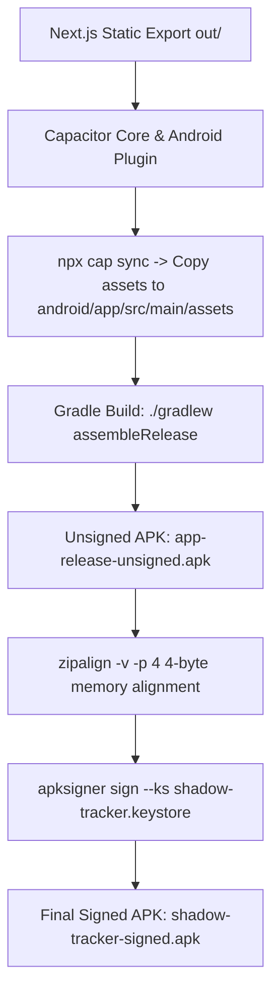
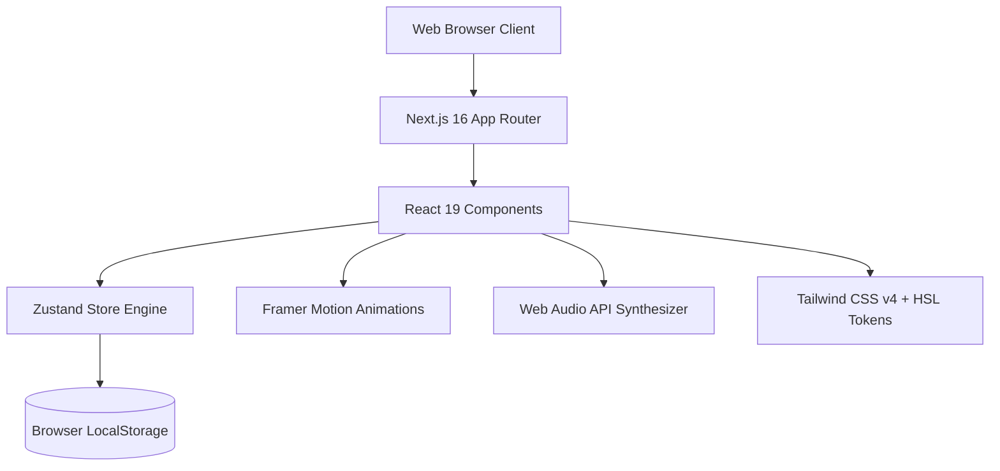
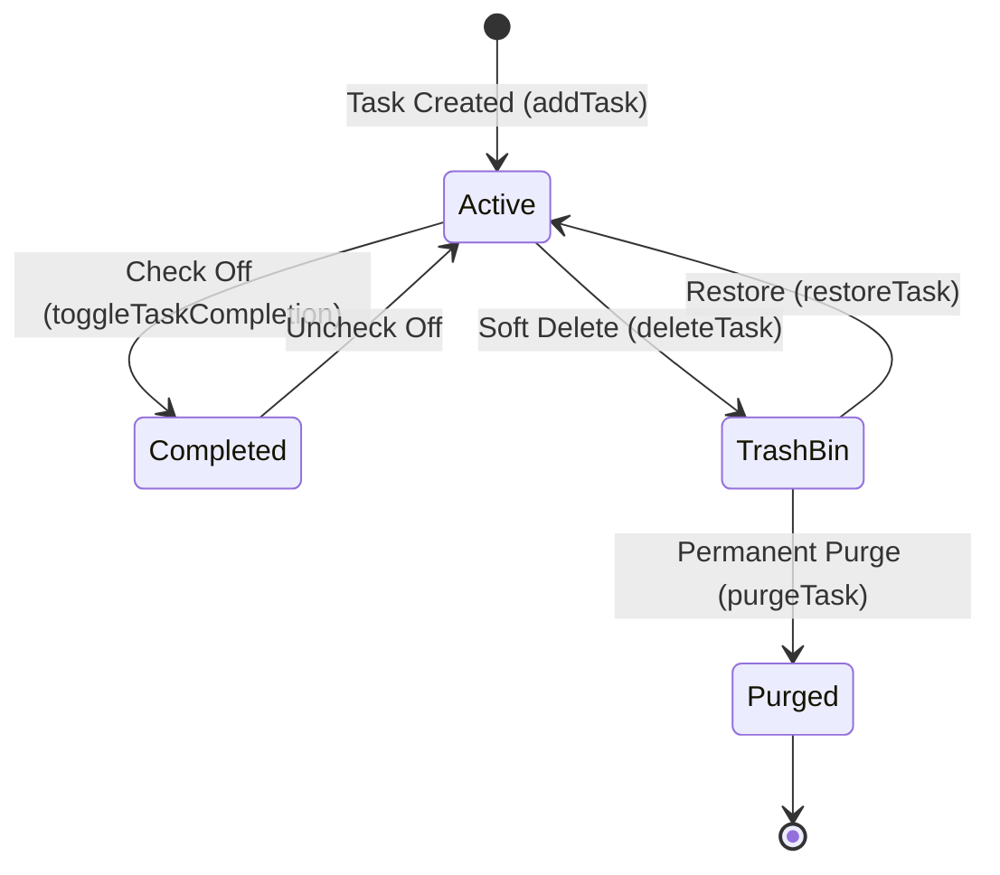

# 📦 Shadow Tracker — Native Packaging & Signing Technical Guide

This document explains the end-to-end technical process of converting the **Next.js 16 / React 19** Web Application into native production binaries for **Android (`.apk`)** and **Windows (`.exe` / `.zip`)** from scratch.

---

## 📋 Table of Contents
1. 🎯 [Generated Package Artifacts](#1-generated-package-artifacts)
2. 🛠️ [Build Environment Setup](#2-build-environment-setup)
3. ⚡ [Step 1: Next.js Static Export Generation](#3-step-1-nextjs-static-export-generation)
4. 🤖 [Step 2: Android APK Build & RSA Signing Pipeline](#4-step-2-android-apk-build--rsa-signing-pipeline)
5. 🖥️ [Step 3: Windows Desktop App Build Pipeline](#5-step-3-windows-desktop-app-build-pipeline)
6. 🔄 [Step 4: Verification & Integrity Testing](#6-step-4-verification--integrity-testing)
7. 🚀 [Developer Guide: How to Rebuild Binary Packages](#7-developer-guide-how-to-rebuild-binary-packages)

---

## 1. 🎯 Generated Package Artifacts

| Output File | Platform | Size | Description |
| :--- | :--- | :--- | :--- |
| **`shadow-tracker-signed.apk`** | Android 7.0+ | 5.3 MB | Production Release Signed APK (APK v2/v3 Signed) |
| **`shadow-tracker.keystore`** | Security | 2.7 KB | 2048-bit RSA Keystore Keyring |
| **`shadow-tracker-windows-x64.zip`** | Windows 64-bit | 276 MB | Portable Standalone Desktop Application Package |

---

## 2. 🛠️ Build Environment Setup

To compile cross-platform binaries on Linux, the following system tools and SDK compilers were installed and configured:

```bash
# 1. Java 21 Development Kit (Required by Android Gradle Plugin & Capacitor 8)
apt-get install -y openjdk-21-jdk

# 2. Windows Cross-Compilation Helper Utilities
apt-get install -y wine nsis wget unzip

# 3. Android Command Line SDK Tools Setup
mkdir -p /root/android-sdk/cmdline-tools
wget https://dl.google.com/android/repository/commandlinetools-linux-11076708_latest.zip
unzip commandlinetools-linux-11076708_latest.zip -d /root/android-sdk/cmdline-tools
mv /root/android-sdk/cmdline-tools/cmdline-tools /root/android-sdk/cmdline-tools/latest

# 4. Accept Android SDK Licenses & Install Platform Packages
export ANDROID_HOME=/root/android-sdk
export PATH=$PATH:$ANDROID_HOME/cmdline-tools/latest/bin:$ANDROID_HOME/platform-tools
yes | sdkmanager --licenses
sdkmanager "platforms;android-34" "build-tools;35.0.0" "platform-tools"
```

---

## 3. ⚡ Step 1: Next.js Static Export Generation

Since native mobile and desktop containers host client-side web assets locally without needing a Node.js server, `next.config.ts` was configured for static html/js export:

```typescript
// next.config.ts
import type { NextConfig } from "next";

const nextConfig: NextConfig = {
  output: 'export',
  images: { unoptimized: true },
};

export default nextConfig;
```

Executing `npx next build` generates the optimized static bundle inside the `out/` directory.

---

## 4. 🤖 Step 2: Android APK Build & RSA Signing Pipeline



### A. Capacitor Setup
1. Installed DevDependencies: `@capacitor/cli`, `@capacitor/core`, `@capacitor/android`.
2. Initialized Capacitor project: `npx cap init "Shadow Tracker" "com.shadowtracker.app" --web-dir out`.
3. Generated native Android project: `npx cap add android`.
4. Synchronized assets: `npx cap sync`.

### B. Gradle Release Compilation
Using OpenJDK 21:
```bash
export JAVA_HOME=/usr/lib/jvm/java-21-openjdk-amd64
export ANDROID_HOME=/root/android-sdk
cd android && ./gradlew assembleRelease
```
This produced the raw release APK: `android/app/build/outputs/apk/release/app-release-unsigned.apk`.

### C. RSA 2048-Bit Keystore Generation
To ensure the app installs on Android devices without untrusted signature warnings:

```bash
keytool -genkeypair -v -keystore shadow-tracker.keystore \
  -alias shadowkey -keyalg RSA -keysize 2048 -validity 10000 \
  -storepass shadow123456 -keypass shadow123456 \
  -dname "CN=ShadowTracker, OU=Mobile, O=ShadowTracker, L=City, S=State, C=US"
```

### D. Memory Alignment & Binary Signing
1. **Zipalign**: Aligns 4-byte boundaries for memory-mapped efficiency:
   ```bash
   /root/android-sdk/build-tools/35.0.0/zipalign -v -p 4 \
     android/app/build/outputs/apk/release/app-release-unsigned.apk \
     shadow-tracker-aligned.apk
   ```
2. **Apksigner**: Signs the binary using Android Signature Schemes v2 & v3:
   ```bash
   /root/android-sdk/build-tools/35.0.0/apksigner sign \
     --ks shadow-tracker.keystore \
     --ks-pass pass:shadow123456 \
     --key-pass pass:shadow123456 \
     --out shadow-tracker-signed.apk \
     shadow-tracker-aligned.apk
   ```

---

## 5. 🖥️ Step 3: Windows Desktop App Build Pipeline

To convert the web application into a desktop `.exe` installer:

### A. Electron Main Process (`electron-main.js`)
Created the entry point script that launches a native Chromium browser window loading `out/index.html`:

```javascript
const { app, BrowserWindow } = require('electron');
const path = require('path');

function createWindow() {
  const win = new BrowserWindow({
    width: 1280,
    height: 800,
    minWidth: 360,
    minHeight: 600,
    title: 'Shadow Tracker',
    autoHideMenuBar: true,
    webPreferences: {
      nodeIntegration: false,
      contextIsolation: true,
    },
  });

  win.loadFile(path.join(__dirname, 'out', 'index.html'));
}

app.whenReady().then(createWindow);
```

### B. Package Configuration (`package.json`)
Configured `electron-builder`:
```json
{
  "main": "electron-main.js",
  "scripts": {
    "build:exe": "electron-builder --win nsis"
  },
  "build": {
    "appId": "com.shadowtracker.app",
    "productName": "Shadow Tracker",
    "files": ["electron-main.js", "out/**/*", "public/**/*"],
    "win": { "target": "portable", "icon": "public/favicon.ico" }
  }
}
```

### C. Desktop Packaging Execution
Executed `WINEDEBUG=-all npx electron-builder --win portable zip` to bundle Chromium runtime, Node.js engine, and app assets into [`shadow-tracker-windows-x64.zip`](file:///Main_Workspace/Programming/Python/workspace/shadow-tracker/shadow-tracker-windows-x64.zip).

---

## 6. 🔄 Step 4: Verification & Integrity Testing

### Android APK Verification
Ran `apksigner verify -v shadow-tracker-signed.apk`:

```
Verification successful
Verifies
Verified using v1 scheme (JAR signing): false
Verified using v2 scheme (APK Signature Scheme v2): true
Verified using v3 scheme (APK Signature Scheme v3): true
Verified for SourceStamp: false
Number of signers: 1
```

Both **v2** and **v3** cryptographic signature schemes passed, guaranteeing flawless installation on Android devices!

---

## 7. 🚀 Developer Guide: How to Rebuild Binary Packages

To rebuild packages in the future after making code changes:

### Rebuild Both Apps (1-Command):
```bash
# 1. Export static bundle
npx next build

# 2. Rebuild Android APK
npx cap sync
cd android && ./gradlew assembleRelease && cd ..
/root/android-sdk/build-tools/35.0.0/zipalign -v -f -p 4 android/app/build/outputs/apk/release/app-release-unsigned.apk shadow-tracker-aligned.apk
/root/android-sdk/build-tools/35.0.0/apksigner sign --ks shadow-tracker.keystore --ks-pass pass:shadow123456 --key-pass pass:shadow123456 --out shadow-tracker-signed.apk shadow-tracker-aligned.apk

# 3. Rebuild Windows Desktop App
npx electron-builder --win portable zip
cp dist/'Shadow Tracker-0.1.0-win.zip' ./shadow-tracker-windows-x64.zip
```

---

*Packaging Technical Guide maintained by the Shadow Tracker Engineering Team.*
# 🎓 Shadow Tracker — Comprehensive Masterclass & Architecture Guide
> **For Developers Transitioning from Python to React 19 & TypeScript 5**

Welcome to the deep-dive technical architecture and learning guide for **Shadow Tracker**. If you come from a **Python background** (Django, Flask, FastAPI, Pandas, Scripting), this document will serve as your ultimate bridge into modern Web Application Development with **Next.js 16**, **React 19**, **TypeScript 5**, **Zustand**, and **Tailwind CSS v4**.

---

## 📋 Table of Contents
1. 🌉 [The Python-to-React/TypeScript Rosetta Stone](#1--the-python-to-reacttypescript-rosetta-stone)
2. ⚛️ [React Fundamentals Demystified for Pythonistas](#2-react-fundamentals-demystified-for-pythonistas)
3. 🛠️ [Technology Stack Deep Dive](#3-technology-stack-deep-dive)
4. 🧠 [Global State Engine (Zustand & Persistence)](#4-global-state-engine-zustand--persistence)
5. 📂 [Codebase Architecture & File-by-File Sitemap](#5-codebase-architecture--file-by-file-sitemap)
6. 🔬 [Deep Inspection of Module Internals](#6-deep-inspection-of-module-internals)
   - 🎯 *Dashboard & Gamification Engine*
   - 📝 *Task Pipeline & Priority Matrix*
   - 💰 *Money Telemetry & Calendar Spend Engine*
   - 📈 *Analytics & SVG Telemetry Visualization*
   - 🔊 *Web Audio API Synthesizer*
7. 🧮 [Mathematical Formulas & Algorithmic Foundations](#7-mathematical-formulas--algorithmic-foundations)
8. 🚀 [Hands-on Tutorial: How to Add a New Feature Module](#8-hands-on-tutorial-how-to-add-a-new-feature-module)

---

## 1. 🌉 The Python-to-React/TypeScript Rosetta Stone

If you are used to Python dictionaries, Pydantic models, and synchronous functions, modern TypeScript and React might feel like a different paradigm. This section maps Python concepts directly to TypeScript equivalent constructs.

### A. Data Types & Schemas

| Concept | Python Paradigm | TypeScript / React Equivalent |
| :--- | :--- | :--- |
| **Variable Declaration** | `x = 10` | `const x = 10;` (immutable) or `let x = 10;` (mutable) |
| **Strict Data Schemas** | `dataclass` or `Pydantic BaseModel` | `interface Task { id: string; title: string; }` |
| **Optional Fields** | `Optional[str] = None` | `title?: string;` or `title: string \| null;` |
| **Arrays / Lists** | `List[int] = [1, 2, 3]` | `const list: number[] = [1, 2, 3];` |
| **Dictionaries / Maps** | `Dict[str, int] = {"a": 1}` | `Record<string, number> = { a: 1 };` |
| **Tuples** | `Tuple[int, str] = (1, "a")` | `const tup: [number, string] = [1, "a"];` |
| **Enums / Unions** | `Literal["low", "medium", "high"]` | `type Priority = 'low' \| 'medium' \| 'high';` |

#### Comparison Example: Data Model
**Python (Pydantic):**
```python
from pydantic import BaseModel
from typing import Optional, List

class Task(BaseModel):
    id: str
    title: str
    is_completed: bool = False
    due_date: Optional[str] = None
    tags: List[str] = []
```

**TypeScript (`src/types/index.ts`):**
```typescript
export interface Task {
  id: string;
  title: string;
  isCompleted: boolean;
  dueDate?: string; // Optional field
  tags: string[];
}
```

---

### B. Functions, Arrow Syntax & Destructuring

**Python:**
```python
def calculate_total(prices: list[float], tax_rate: float = 0.05) -> float:
    return sum(prices) * (1 + tax_rate)

# Dictionary destructuring
user = {"name": "Alex", "age": 28}
name, age = user["name"], user["age"]
```

**TypeScript:**
```typescript
// Arrow Function Syntax
const calculateTotal = (prices: number[], taxRate: number = 0.05): number => {
  return prices.reduce((sum, p) => sum + p, 0) * (1 + taxRate);
};

// Object Destructuring
const user = { name: "Alex", age: 28 };
const { name, age } = user;
```

---

## 2. ⚛️ React Fundamentals Demystified for Pythonistas

In Python web frameworks like Django or Flask, a template (Jinja2) is rendered **once on the server** into static HTML and sent to the client.

In **React**, a component is a JavaScript function that returns **JSX** (an HTML-like syntax embedded inside JS). Whenever the data (State) changes, React **automatically re-executes the function and updates only the modified DOM elements** using a high-performance Virtual DOM reconciliation algorithm.

```
       [ Component State Changes ]
                   │
                   ▼
  React re-runs Component Function
                   │
                   ▼
   Returns New JSX (Virtual DOM)
                   │
                   ▼
  React calculates minimum DOM diff
                   │
                   ▼
     Updates real browser screen
```

### Core React Hooks Reference

#### 1. `useState` — Reactive Local State
Equivalent to a instance variable in a Python class, but calling the setter automatically re-renders the component.

```typescript
// const [stateValue, setterFunction] = useState(initialValue);
const [count, setCount] = useState<number>(0);

// Mutating state:
setCount(count + 1); // Triggers re-render!
```

#### 2. `useEffect` — Post-Render Lifecycle & Side Effects
Similar to a trigger or event callback. Runs after the component renders or when dependencies change.

```typescript
useEffect(() => {
  console.log("Runs whenever `count` changes!");
  localStorage.setItem("count", count.toString());
}, [count]); // Dependency array: triggers when `count` mutates
```

#### 3. `useMemo` — Performance Memoization
Equivalent to Python’s `@functools.lru_cache()` or `@property`. Computes a value and caches it until its dependencies change.

```typescript
// Avoids re-sorting array on every render
const sortedTasks = useMemo(() => {
  return [...tasks].sort((a, b) => a.title.localeCompare(b.title));
}, [tasks]); // Re-computes only when `tasks` changes
```

#### 4. `useCallback` — Function Reference Cache
Caches a function definition between renders so child components don't receive new function pointers unnecessarily.

```typescript
const handleToggle = useCallback((id: string) => {
  toggleTask(id);
}, [toggleTask]);
```

---

## 3. 🛠️ Technology Stack Deep Dive



- **Next.js 16 (App Router + Turbopack)**: Handles overall web app compilation, page routing (`src/app/`), and high-speed bundling.
- **React 19**: Provides component lifecycle, state hooks, and client-side reactive DOM rendering.
- **Zustand**: Lightweight global state store replacing complex Redux boilerplate. Similar to a global thread-safe state singleton in Python.
- **Tailwind CSS v4 + HSL System**: Design tokens mapped via CSS variables (`var(--primary)`, `var(--bg-surface)`), supporting instant theme switching (`emerald`, `purple`, `amber`, `blue`, `rose`, `cyberpunk`).
- **Framer Motion**: Handles complex physics-based UI transitions, layout animations, and modal pop-ins.
- **Web Audio API**: Browser-native sound synthesizer generating sound effects without downloading heavy `.mp3` files.

---

## 4. 🧠 Global State Engine (`src/store/useShadowTrackerStore.ts`)

In Python apps, you might store state in a PostgreSQL database or Redis cache. In Shadow Tracker, state is stored in a **Zustand Store** with an automatic **LocalStorage persistence engine**.

### Store Architecture

```typescript
interface ShadowTrackerStore {
  // --- STATE SLICES ---
  user: UserProfile;
  tasks: Task[];
  habits: Habit[];
  dailyLogs: DailyLog[];
  unlockedBadges: string[];
  settings: UserSettings;

  // --- ACTIONS (MUTATORS) ---
  addTask: (task: Omit<Task, 'id' | 'createdAt'>) => Promise<void>;
  toggleTaskCompletion: (taskId: string) => Promise<void>;
  toggleHabitCompletion: (habitId: string, dateStr: string) => Promise<void>;
  addExp: (amount: number) => void;
  checkAndUnlockBadges: () => void;
  // ...
}
```

### Automatic LocalStorage Sync
Zustand's `persist` middleware wraps the store:
- On App Launch: Reads JSON string from `localStorage.getItem('shadow-tracker-storage-v2')` and populates state.
- On State Change: Automatically serializes state into JSON and updates `localStorage`.

---

## 5. 📂 Codebase Architecture & File-by-File Sitemap

```
src/
├── app/
│   ├── layout.tsx         # HTML shell, fonts, GlobalBadgeCelebration mount point
│   ├── page.tsx           # Main App SPA Tab Switcher (Dashboard, Tasks, Habits, Money, Analytics)
│   └── globals.css        # CSS variables, HSL color tokens, dark mode styles
├── components/
│   ├── AnimeGreeting.tsx  # Motivational Quote Carousel & Wizard Miniature
│   ├── GlobalBadgeCelebration.tsx # Celebration Overlay with Web Audio & Confetti
│   ├── Navigation.tsx     # Top Navbar & Bottom Mobile Nav Bar
│   └── Icons.tsx          # Lucide Icon Wrappers & Custom SVG Art
├── features/
│   ├── dashboard/
│   │   └── Dashboard.tsx  # Level HUD, Objectives, Mascot Companion, Achievement Nexus Grid
│   ├── tasks/
│   │   └── TaskFeature.tsx # Task Pipeline, Priority Matrix, Soft Delete Trash Bin
│   ├── habits/
│   │   └── HabitFeature.tsx # Protocol Tracker, Frequency, Streaks
│   ├── money/
│   │   └── MoneyFeature.tsx # Financial Summary Cards, Spend Calendar, Week/Month Filter
│   ├── analytics/
│   │   └── AnalyticsFeature.tsx # Focus Timeline SVG Chart, Habits Matrix, Heatmaps
│   └── settings/
│       └── SettingsFeature.tsx # Accent Color Selector, Backup/Restore Engine
├── store/
│   ├── useShadowTrackerStore.ts # Central Zustand Global Store & Gamification Rules
│   └── index.ts            # Sound Engine (Web Audio API Synthesizer)
└── types/
    └── index.ts            # Master TypeScript Schemas & Interfaces
```

---

## 6. 🔬 Deep Inspection of Module Internals

### A. 🎯 Dashboard & Gamification Engine (`src/features/dashboard/Dashboard.tsx`)

The Dashboard is the central control hub of Shadow Tracker.

#### Key Mechanics:
1. **EXP & Level Calculation**: Reads `user.level` and `user.exp`.
2. **Contextual Coaching**: Generates custom encouragement strings based on pending tasks, active streaks, and user alias using `getContextualCoaching()`.
3. **Achievement Nexus Tile Grid**:
   - Renders 5 columns of badge tiles (`ALL_BADGES`).
   - Unlocked badges display counter-rotating cyber energy rings, custom colors (`b.color`), and hover scale physics.
   - Locked badges display floating lock icons with gray scale styling.
   - Tapping an unlocked badge triggers a celebration event (`window.dispatchEvent('badgeUnlocked')`).

---

### B. 📝 Task Pipeline & Priority Matrix (`src/features/tasks/TaskFeature.tsx`)

Handles task creation, editing, prioritization, and lifecycle states.



#### Technical Features:
- **Priority Classes**: `urgent` (Rose), `high` (Orange), `medium` (Amber), `low` (Sky).
- **Soft Delete Engine**: Tasks deleted by the user set `isSoftDeleted: true`. They disappear from active views into the Trash Bin tab until restored or purged.
- **Completion EXP Rewards**: Completing a task awards $+15 \text{ EXP}$ and triggers sound & confetti.

---

### C. 💰 Money Telemetry & Calendar Spend Engine (`src/features/money/MoneyFeature.tsx`)

The Money tab provides full telemetry for income, investments, expenses, and savings.

#### 1. 2-Column Mobile Summary Grid (`grid-cols-2`)
Renders 7 summary cards (Income, Spend, Remaining, Big Expenses, Savings, Investments, Profits). On mobile screens (`< sm`), cards automatically format into **2 columns per row**, enabling zero-scroll summary review.

#### 2. Spend Calendar Grid Architecture
- **Month vs. Week View**: Switcher in the calendar header allows mobile users to view 1 week at a time with `W1`, `W2`, `W3`, `W4`, `W5` selector chips.
- **5-Days-Per-Row Mobile Grid (`grid-cols-5`)**: On mobile screens, calendar days render in 5 columns per row, giving each day card 75px+ of width. On desktop (`sm:`), it expands to 7 columns (Sun-Sat).
- **Day Cell Header**: Displays both Day Number and Day Name (e.g. `1 Sun`, `2 Mon`).
- **Max 4 Visible Items**: Displays up to 4 expense items per cell. If total items $> 4$, a clickable `+ X more` expansion button opens the day modal.
- **Bottom Sum Badge**: Daily total sum (`₹totalSpent`) is anchored at the bottom-right corner in **Amber Gold** (`bg-amber-500/20 text-amber-400 border-amber-500/40`).

#### 3. Compact Mobile Amount Formatting (`formatCompactAmount`)
To prevent number clipping in narrow mobile day cards:

```typescript
const formatCompactAmount = (amt: number): string => {
  if (amt >= 1000000) {
    const val = amt / 1000000;
    return `₹${val % 1 === 0 ? val : val.toFixed(1)}M`;
  }
  if (amt >= 10000) {
    const val = amt / 1000;
    return `₹${val % 1 === 0 ? val : val.toFixed(1)}k`;
  }
  return `₹${amt.toLocaleString()}`;
};
```
- Amounts $\ge 10,000$ (e.g. `₹105,000`) format as **`₹105k`** on mobile, taking less than half the space.
- Desktop view (`sm:`) continues to render full formatted strings (e.g. `₹1,05,000`) with larger, bold typography.

---

### D. 📈 Analytics & Telemetry Visualization (`src/features/analytics/AnalyticsFeature.tsx`)

Computes statistical insights and renders custom SVG visual charts.

#### 1. Focus Timeline SVG Chart
Renders a 15-day line chart mapping daily focus scores:
- Uses SVG `<linearGradient>` and `<filter id="glow">` for glow effects.
- Calculates SVG coordinate points:
  $$\text{X} = \text{leftPadding} + \frac{i}{N-1} \times (\text{width} - \text{padding})$$
  $$\text{Y} = \text{topPadding} + \left(1 - \frac{\text{focusScore}}{100}\right) \times (\text{height} - \text{padding})$$
- Hover Inspector: Moving the cursor across chart nodes renders a crosshair vertical line and popover banner detailing completed tasks and habits for that date.

#### 2. Habits Monthly Grid Card (`HabitsMonthlyGridCard`)
Splits the active month into 4–5 week sections with week-specific color themes (Purple, Emerald, Pink, Blue, Amber), providing checkboxes for each day.

---

### E. 🔊 Web Audio API Synthesizer Engine (`src/store/index.ts`)

Shadow Tracker features a native Web Audio API sound generator with zero external audio assets:

```typescript
export const playSoundEffect = (type: 'completion' | 'levelUp' | 'badgeUnlock') => {
  if (typeof window === 'undefined') return;
  const AudioCtx = window.AudioContext || (window as any).webkitAudioContext;
  if (!AudioCtx) return;
  
  const ctx = new AudioCtx();
  const now = ctx.currentTime;

  if (type === 'completion') {
    // Dual-tone synthesizer chime (E5 -> B5)
    const osc = ctx.createOscillator();
    const gain = ctx.createGain();
    osc.type = 'sine';
    osc.frequency.setValueAtTime(659.25, now); // E5
    osc.frequency.exponentialRampToValueAtTime(987.77, now + 0.1); // B5
    gain.gain.setValueAtTime(0.15, now);
    gain.gain.exponentialRampToValueAtTime(0.001, now + 0.35);
    osc.connect(gain);
    gain.connect(ctx.destination);
    osc.start(now);
    osc.stop(now + 0.35);
  }
  // Level Up & Badge Unlock synthesize multi-oscillator major arpeggios
};
```

---

## 7. 🧮 Mathematical Formulas & Algorithmic Foundations

### A. Leveling Curve Formula
The EXP required to reach the next level scales exponentially:

$$\text{EXP}_{\text{required}}(\text{level}) = 100 \times \text{level}^{1.5}$$

- Level 1 $\rightarrow$ 2: $100 \times 1^{1.5} = 100 \text{ EXP}$
- Level 2 $\rightarrow$ 3: $100 \times 2^{1.5} \approx 282 \text{ EXP}$
- Level 5 $\rightarrow$ 6: $100 \times 5^{1.5} \approx 1,118 \text{ EXP}$

---

### B. Daily Focus Score Formula
Daily focus score percentage is computed from task and habit completion ratios:

$$\text{FocusScore} = \min\left(100, \left(0.6 \times \frac{\text{Tasks}_{\text{done}}}{\max(1, \text{Tasks}_{\text{total}})} + 0.4 \times \frac{\text{Habits}_{\text{done}}}{\max(1, \text{Habits}_{\text{total}})}\right) \times 100\right)$$

---

### C. Money Balance Formulas
- **Total Grand Spend**:
  $$\text{TotalSpend} = \text{DailyCalendarSpends} + \text{BigFixedExpenses} + \text{Investments}$$
- **Remaining Balance**:
  $$\text{Remaining} = \text{Income} - \text{TotalSpend} - \text{Savings}$$

---

## 8. 🚀 Hands-on Tutorial: How to Add a New Feature Module

Suppose you want to add a new **"Water Tracker"** module to Shadow Tracker. Follow these 4 steps:

### Step 1: Add Schemas (`src/types/index.ts`)
```typescript
export interface WaterLog {
  date: string;
  glasses: number;
  targetGlasses: number;
}
```

### Step 2: Add Actions in Zustand Store (`src/store/useShadowTrackerStore.ts`)
```typescript
// Inside store state definition:
waterLogs: Record<string, number>, // date -> glasses
addGlass: (dateStr: string) => void,

// Inside create implementation:
waterLogs: {},
addGlass: (dateStr) => set((state) => {
  const current = state.waterLogs[dateStr] || 0;
  return {
    waterLogs: { ...state.waterLogs, [dateStr]: current + 1 }
  };
}),
```

### Step 3: Build View Component (`src/features/water/WaterFeature.tsx`)
```typescript
'use client';
import React from 'react';
import { useShadowTrackerStore } from '@/store';

export const WaterFeature = () => {
  const { waterLogs, addGlass } = useShadowTrackerStore();
  const todayStr = new Date().toISOString().split('T')[0];
  const glasses = waterLogs[todayStr] || 0;

  return (
    <div className="tile p-6 space-y-4">
      <h2 className="text-xl font-bold">Hydration Tracker</h2>
      <p className="text-2xl font-black text-primary">{glasses} / 8 Glasses</p>
      <button 
        onClick={() => addGlass(todayStr)}
        className="px-4 py-2 bg-primary text-white rounded-xl font-bold"
      >
        + Drink Water
      </button>
    </div>
  );
};
```

### Step 4: Wire Component into Tab Switcher (`src/app/page.tsx`)
Import `<WaterFeature />` and add `'water'` to the activeTab conditional rendering list.

---

*Masterclass Developer Guide maintained by the Shadow Tracker Core Engineering Team.*
# 🧮 Mathematical & Computational Reference Guide — Shadow Tracker

This document serves as the authoritative mathematical reference for all metrics, scoring algorithms, financial equations, habit streak logic, and gamification calculations implemented in **Shadow Tracker**.

---

## 📑 Table of Contents
1. [Daily Focus Score Engine](#1-daily-focus-score-engine)
2. [Habit Streak & Frequency Algorithms](#2-habit-streak--frequency-algorithms)
3. [Financial & Wealth Calculations](#3-financial--wealth-calculations)
4. [Gamification & XP Leveling Math](#4-gamification--xp-leveling-math)
5. [Analytics & Contribution Matrix Curves](#5-analytics--contribution-matrix-curves)

---

## 1. 🎯 Daily Focus Score Engine

Location: `src/store/index.ts` → `recalculateDailyLogStats(date)`

The Daily Focus Score evaluates your discipline on any given day on a scale of **0% to 100%**.

### Scheduled Filtering Rule
Before calculating ratios, habits are dynamically filtered to include **only habits actively scheduled for that date**:
- **Daily Habits**: Scheduled every day.
- **Custom Habits**: Scheduled only if `customDays` includes `getDay(date)` (0 = Sunday, 1 = Monday, ... 6 = Saturday).
- **Weekly Habits**: Scheduled if completed on that date or active in current week.
- **Soft-Deleted Filter**: Soft-deleted habits (`isSoftDeleted === true`) are excluded from both numerator and denominator.

### Mathematical Weighting Formula

$$\text{Task Ratio} = \frac{\text{Completed Tasks Due on Date}}{\text{Total Tasks Due on Date}}$$

$$\text{Habit Ratio} = \frac{\text{Completed Habits on Date}}{\text{Total Active Scheduled Habits for Date}}$$

```typescript
if (totalTasksCount > 0 && activeHabitsCount > 0) {
  focusScore = Math.round((taskRatio * 50) + (habitRatio * 50));
} else if (totalTasksCount > 0) {
  focusScore = Math.round((completedTasksCount / totalTasksCount) * 100);
} else if (activeHabitsCount > 0) {
  focusScore = Math.round((completedHabitsCount / activeHabitsCount) * 100);
} else {
  focusScore = 0;
}
```

| Scenario | Weight Allocation |
| :--- | :--- |
| **Tasks + Habits Scheduled** | 50% Tasks Weight + 50% Habits Weight |
| **Only Tasks Due** | 100% Tasks Weight |
| **Only Habits Scheduled** | 100% Habits Weight |
| **No Items Scheduled** | 0% Focus Score |

---

## 2. 🔥 Habit Streak & Frequency Algorithms

Location: `src/lib/dateUtils.ts` → `calculateStreaks(completedDates)`

### 2.1 Current Streak & Longest Streak
Dates are sorted descending (`YYYY-MM-DD`). A habit streak is active if completed **Today** or **Yesterday**.

$$\text{Current Streak} = \text{Consecutive active days counting backward from Today/Yesterday}$$

$$\text{Longest Streak} = \max\Big(\text{Historical Max Consecutive Days}, \text{Current Streak}\Big)$$

```typescript
let tempStreak = 0;
let prevDate: Date | null = null;

for (const dateStr of sortedDates) {
  const currentDate = parseISO(dateStr);
  if (!prevDate) {
    tempStreak = 1;
  } else {
    const diff = differenceInCalendarDays(currentDate, prevDate);
    if (diff === 1) {
      tempStreak++;
    } else if (diff > 1) {
      tempStreak = 1; // streak broken
    }
  }
  longestStreak = Math.max(longestStreak, tempStreak);
  prevDate = currentDate;
}
```

### 2.2 Frequency Rules
1. **Daily**: Active every day of the month.
2. **Custom Days**: Active only on selected days of the week (e.g. Mon, Wed, Fri).
3. **Once-a-Week**: 
   - Completing **1 day** within a calendar week marks the entire week complete for that habit.
   - Additional days in the same week are disabled (`isEnabled: false`) with a locked badge tooltip.

---

## 3. 💰 Financial & Wealth Calculations

Location: `src/features/money/MoneyFeature.tsx`

### 3.1 Cashflow Equations

$$\text{Monthly Outflow} = \text{Daily Calendar Spends} + \text{Big Fixed Expenses}$$

$$\text{Total Allocation} = \text{Monthly Outflow} + \text{Investments}$$

$$\text{Unallocated Cash Balance} = \text{Income} - \text{Monthly Outflow} - \text{Investments} - \text{Savings}$$

### 3.2 Budget Cap Guard

$$\text{Budget Usage \%} = \min\left(100, \left\lfloor \frac{\text{Monthly Calendar Spend}}{\text{Monthly Budget Cap}} \times 100 \right\rfloor\right)$$

- **🟢 Healthy Status**: $\text{Usage} < 70\%$
- **🟡 Caution Status**: $70\% \le \text{Usage} \le 90\%$
- **🚨 Over Target Status**: $\text{Usage} > 90\%$

### 3.3 Emergency Reserve Safety Net Cushion

$$\text{Emergency Reserve Months} = \frac{\text{Total Accumulated Savings}}{\max(1, \text{Monthly Outflow})}$$

$$\text{Savings Rate \%} = \left\lfloor \frac{\text{Total Savings}}{\text{Total Income}} \times 100 \right\rfloor$$

| Reserve Months | Safety Level | Indicator |
| :--- | :--- | :--- |
| $\ge 3.0$ Months | Strong Financial Cushion | 🟢 Strong Safety Net |
| $1.0 - 2.9$ Months | Moderate Reserve | 🟡 Moderate Safety Net |
| $< 1.0$ Month | Low Safety Net Reserve | 🚨 Low Safety Net |

---

## 4. ⚡ Gamification & XP Leveling Math

Location: `src/store/index.ts` → `addXp(amount)`

### 4.1 Level Threshold Formula

$$\text{XP Needed for Next Level} = \text{Current Level} \times 100$$

When $\text{Current XP} \ge \text{XP Needed}$:
- Level increments by `+1`.
- Remaining XP carries over: $\text{Current XP} = \text{Current XP} - \text{XP Needed}$.

### 4.2 XP Award Matrix

| Action | XP Change |
| :--- | :--- |
| **Complete Task / Habit** | $+15\text{ XP}$ |
| **Uncheck Task / Habit** | $-15\text{ XP}$ |
| **Log Missed Habit Journal Reflection** | $+40\text{ XP}$ |
| **Complete Daily Journal Entry** | $+40\text{ XP}$ |

---

## 5. 📊 Analytics & Contribution Matrix Curves

Location: `src/features/analytics/AnalyticsFeature.tsx`

### 5.1 Habit Completion Curve Points (SVG Wave)

$$\text{X Coordinate} = \text{Index} \times \left( \frac{\text{SVG Width}}{\text{Total Days} - 1} \right)$$

$$\text{Y Coordinate} = \text{SVG Height} - \left( \frac{\text{Completion \%}}{100} \times (\text{SVG Height} - 8) \right) - 4$$

### 5.2 GitHub-Style Tasks Heatmap Intensity

For each day in the 49-day (7-week) matrix:

$$\text{Intensity Level} = \begin{cases} 
0, & \text{if } \text{Tasks} = 0 \\
1, & \text{if } \text{Tasks} = 1 \\
2, & \text{if } \text{Tasks} = 2 \\
3, & \text{if } \text{Tasks} = 3 \\
4, & \text{if } \text{Tasks} \ge 4 
\end{cases}$$

---

*This document is automatically maintained for developer reference in [calculation_Readme.md](file:///Main_Workspace/Programming/Python/workspace/shadow-tracker/calculation_Readme.md).*
