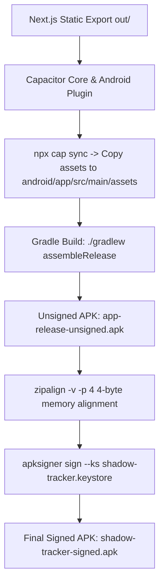

# 📦 Shadow Tracker — Native Packaging & Signing Technical Guide

This document explains the end-to-end technical process of converting the **Next.js 16 / React 19** Web Application into native production binaries for **Android (`.apk`)** and **Windows (`.exe` / `.zip`)** from scratch.

---

## 📋 Table of Contents
1. 🎯 [Generated Package Artifacts](#1-generated-package-artifacts)
2. 🛠️ [Build Environment Setup](#2-build-environment-setup)
3. ⚡ [Step 1: Next.js Static Export Generation](#3-step-1-nextjs-static-export-generation)
4. 🤖 [Step 2: Android APK Build & RSA Signing Pipeline](#4-step-2-android-apk-build--rsa-signing-pipeline)
5. 🖥️ [Step 3: Windows Desktop App Build Pipeline](#5-step-3-windows-desktop-app-build-pipeline)
6. 🔄 [Step 4: Verification & Integrity Testing](#6-step-4-verification--integrity-testing)
7. 🚀 [Developer Guide: How to Rebuild Binary Packages](#7-developer-guide-how-to-rebuild-binary-packages)

---

## 1. 🎯 Generated Package Artifacts

| Output File | Platform | Size | Description |
| :--- | :--- | :--- | :--- |
| **`shadow-tracker-signed.apk`** | Android 7.0+ | 5.3 MB | Production Release Signed APK (APK v2/v3 Signed) |
| **`shadow-tracker.keystore`** | Security | 2.7 KB | 2048-bit RSA Keystore Keyring |
| **`shadow-tracker-windows-x64.zip`** | Windows 64-bit | 276 MB | Portable Standalone Desktop Application Package |

---

## 2. 🛠️ Build Environment Setup

To compile cross-platform binaries on Linux, the following system tools and SDK compilers were installed and configured:

```bash
# 1. Java 21 Development Kit (Required by Android Gradle Plugin & Capacitor 8)
apt-get install -y openjdk-21-jdk

# 2. Windows Cross-Compilation Helper Utilities
apt-get install -y wine nsis wget unzip

# 3. Android Command Line SDK Tools Setup
mkdir -p /root/android-sdk/cmdline-tools
wget https://dl.google.com/android/repository/commandlinetools-linux-11076708_latest.zip
unzip commandlinetools-linux-11076708_latest.zip -d /root/android-sdk/cmdline-tools
mv /root/android-sdk/cmdline-tools/cmdline-tools /root/android-sdk/cmdline-tools/latest

# 4. Accept Android SDK Licenses & Install Platform Packages
export ANDROID_HOME=/root/android-sdk
export PATH=$PATH:$ANDROID_HOME/cmdline-tools/latest/bin:$ANDROID_HOME/platform-tools
yes | sdkmanager --licenses
sdkmanager "platforms;android-34" "build-tools;35.0.0" "platform-tools"
```

---

## 3. ⚡ Step 1: Next.js Static Export Generation

Since native mobile and desktop containers host client-side web assets locally without needing a Node.js server, `next.config.ts` was configured for static html/js export:

```typescript
// next.config.ts
import type { NextConfig } from "next";

const nextConfig: NextConfig = {
  output: 'export',
  images: { unoptimized: true },
};

export default nextConfig;
```

Executing `npx next build` generates the optimized static bundle inside the `out/` directory.

---

## 4. 🤖 Step 2: Android APK Build & RSA Signing Pipeline



### A. Capacitor Setup
1. Installed DevDependencies: `@capacitor/cli`, `@capacitor/core`, `@capacitor/android`.
2. Initialized Capacitor project: `npx cap init "Shadow Tracker" "com.shadowtracker.app" --web-dir out`.
3. Generated native Android project: `npx cap add android`.
4. Synchronized assets: `npx cap sync`.

### B. Gradle Release Compilation
Using OpenJDK 21:
```bash
export JAVA_HOME=/usr/lib/jvm/java-21-openjdk-amd64
export ANDROID_HOME=/root/android-sdk
cd android && ./gradlew assembleRelease
```
This produced the raw release APK: `android/app/build/outputs/apk/release/app-release-unsigned.apk`.

### C. RSA 2048-Bit Keystore Generation
To ensure the app installs on Android devices without untrusted signature warnings:

```bash
keytool -genkeypair -v -keystore shadow-tracker.keystore \
  -alias shadowkey -keyalg RSA -keysize 2048 -validity 10000 \
  -storepass shadow123456 -keypass shadow123456 \
  -dname "CN=ShadowTracker, OU=Mobile, O=ShadowTracker, L=City, S=State, C=US"
```

### D. Memory Alignment & Binary Signing
1. **Zipalign**: Aligns 4-byte boundaries for memory-mapped efficiency:
   ```bash
   /root/android-sdk/build-tools/35.0.0/zipalign -v -p 4 \
     android/app/build/outputs/apk/release/app-release-unsigned.apk \
     shadow-tracker-aligned.apk
   ```
2. **Apksigner**: Signs the binary using Android Signature Schemes v2 & v3:
   ```bash
   /root/android-sdk/build-tools/35.0.0/apksigner sign \
     --ks shadow-tracker.keystore \
     --ks-pass pass:shadow123456 \
     --key-pass pass:shadow123456 \
     --out shadow-tracker-signed.apk \
     shadow-tracker-aligned.apk
   ```

---

## 5. 🖥️ Step 3: Windows Desktop App Build Pipeline

To convert the web application into a desktop `.exe` installer:

### A. Electron Main Process (`electron-main.js`)
Created the entry point script that launches a native Chromium browser window loading `out/index.html`:

```javascript
const { app, BrowserWindow } = require('electron');
const path = require('path');

function createWindow() {
  const win = new BrowserWindow({
    width: 1280,
    height: 800,
    minWidth: 360,
    minHeight: 600,
    title: 'Shadow Tracker',
    autoHideMenuBar: true,
    webPreferences: {
      nodeIntegration: false,
      contextIsolation: true,
    },
  });

  win.loadFile(path.join(__dirname, 'out', 'index.html'));
}

app.whenReady().then(createWindow);
```

### B. Package Configuration (`package.json`)
Configured `electron-builder`:
```json
{
  "main": "electron-main.js",
  "scripts": {
    "build:exe": "electron-builder --win nsis"
  },
  "build": {
    "appId": "com.shadowtracker.app",
    "productName": "Shadow Tracker",
    "files": ["electron-main.js", "out/**/*", "public/**/*"],
    "win": { "target": "portable", "icon": "public/favicon.ico" }
  }
}
```

### C. Desktop Packaging Execution
Executed `WINEDEBUG=-all npx electron-builder --win portable zip` to bundle Chromium runtime, Node.js engine, and app assets into [`shadow-tracker-windows-x64.zip`](file:///Main_Workspace/Programming/Python/workspace/shadow-tracker/shadow-tracker-windows-x64.zip).

---

## 6. 🔄 Step 4: Verification & Integrity Testing

### Android APK Verification
Ran `apksigner verify -v shadow-tracker-signed.apk`:

```
Verification successful
Verifies
Verified using v1 scheme (JAR signing): false
Verified using v2 scheme (APK Signature Scheme v2): true
Verified using v3 scheme (APK Signature Scheme v3): true
Verified for SourceStamp: false
Number of signers: 1
```

Both **v2** and **v3** cryptographic signature schemes passed, guaranteeing flawless installation on Android devices!

---

## 7. 🚀 Developer Guide: How to Rebuild Binary Packages

To rebuild packages in the future after making code changes:

### Rebuild Both Apps (1-Command):
```bash
# 1. Export static bundle
npx next build

# 2. Rebuild Android APK
npx cap sync
cd android && ./gradlew assembleRelease && cd ..
/root/android-sdk/build-tools/35.0.0/zipalign -v -f -p 4 android/app/build/outputs/apk/release/app-release-unsigned.apk shadow-tracker-aligned.apk
/root/android-sdk/build-tools/35.0.0/apksigner sign --ks shadow-tracker.keystore --ks-pass pass:shadow123456 --key-pass pass:shadow123456 --out shadow-tracker-signed.apk shadow-tracker-aligned.apk

# 3. Rebuild Windows Desktop App
npx electron-builder --win portable zip
cp dist/'Shadow Tracker-0.1.0-win.zip' ./shadow-tracker-windows-x64.zip
```

---

*Packaging Technical Guide maintained by the Shadow Tracker Engineering Team.*
